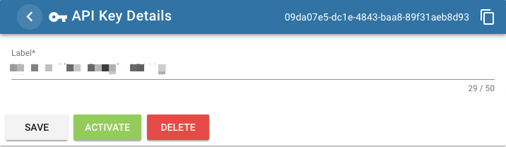

= ID4i API Client Example - C#

ID4i provides globally unique IDs for single workpieces and a platform to manage, and exchange data bound to IDs in an inter-organizational manner. For details, please refer to http://id4i.de.

This repository contains all example C# .Net API Client for ID4i.
For detailed documentation of ID4i see https://backend.id4i.de/docs/reference/en/reference.html#_tutorials

The sources of the client library we use to connect to ID4i along with further documentation is available here: https://github.com/BlueRainSoftware/id4i-api_client-csharp

== Prerequisites

* .NET Core SDK >= 1.3

== Preparation

To be able to connect to ID4i with an API client, you need to register and set up an API key for
your application first. Using this key, you can sign https://jwt.io/[JWTs] to send as `Authorization` header for
subsequent requests.

. If you do not already have an ID4i account, please register at https://backend.id4i.de and log in.
. Navigate to `API Keys` and select `New API Key`
+
.New API Key
image::img/readme-new-api-key.png[]
. Give your key a label and enter an application secret (or let the application generate one for you). footnote:[When using asymmetric signing, you would use your public key here.]
+
.API Key Label and Secret
image::img/readme-new-api-key-2.png[]

. Save your secret resp. your public key in a secure location.  For security reasons, you won't be able to display
this key again in ID4i.

. Activate the key on the details page
+
.API Key Activation



WARNING: Do not store your API Keys and Secrets with the source code of your application. Either supply the key as a configuration property of your application or retrieve it from your own server when required in the
application. Use a separate API Key for each deployment of your application.

== Run 

Once you have set up your API key, you need to set the environment variables `ID4I_API_KEY` and `ID4I_API_SECRET` to reflect your key.
You can then run the project using `dotnet run`.

You should see some information about the version running on the https://backend.id4i.de now:

```
$ dotnet run

class AppInfoPresentation {
  Branch: master
  CommitTime: 2018-03-16T14:51:47+0000
  Name: ID4i
  Revision: 4584e5c
  Version: 0.3.0
}
```

== How this project was set up

```
dotnet new console -o ID4iClientSample
dotnet add package BlueRain.ID4i
dotnet add package System.IdentityModel.Tokens.Jwt
```
